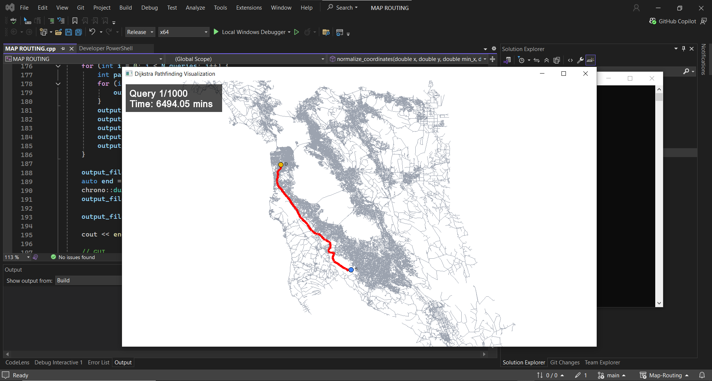

# Map Routing System using Dijkstra Algorithm

A high-performance **map routing system** that computes the fastest path between two geographic locations using **Dijkstra's Algorithm**.

The system models a real road network as a graph and calculates the shortest travel time considering both **vehicle movement on roads** and **walking distance to/from intersections**.

In addition to the algorithmic solution, the project includes a **graphical visualization using SFML** that displays the map and the computed route.

---

# Problem Overview

Navigation systems such as GPS rely on efficient routing algorithms to determine the best path between two locations.

In this project, the road network is represented as a **graph**:

- **Vertices (Nodes):** road intersections
- **Edges:** roads connecting intersections
- Each road has:
  - Length (km)
  - Maximum allowed speed (km/h)

The goal is to compute the **fastest route from a source location to a destination location**.

However, the source and destination are **not necessarily located on intersections**.

Therefore:

- A person can **walk to nearby intersections** from the source
- A person can **walk from intersections to the destination**
- Walking speed is **5 km/h**
- Walking distance is limited to **R meters**

The algorithm must determine the optimal combination of **walking + driving** to minimize the total travel time.

---

# Input Format

The program reads two main files.

## Map File

Contains:

- Number of intersections
- Coordinates of each intersection
- Road connections between intersections

Each road contains:

- Starting intersection
- Ending intersection
- Road length
- Road speed

Example:

6

0 0.25 0.33

1 0.73 0.47

2 1.00 0.54

3 0.34 0.60

4 0.81 0.20

5 1.07 0.28

Edges:

0 1 0.50 20

0 3 0.28 80

3 4 0.62 80

1 4 0.28 40

1 2 0.28 40

4 5 0.27 60

2 5 0.27 60

---

## Queries File

Contains routing requests.

Each query includes:

Source_x Source_y Destination_x Destination_y R

Where **R** is the maximum walking distance.

Example:

1

0.16 0.21 1.09 0.44 300

---

# Output

The program generates an output file containing:

- The nodes of the shortest path
- Total travel time
- Total path length
- Total walking distance
- Total vehicle distance
- Execution time

Example output:

- Path nodes: 0 → 3 → 4 → 5 → 2
- Shortest time = 4.63 mins
- Path length = 1.72 km
- Total walking distance = 0.28 km
- Total road distance = 1.44 km

---

# Visualization (SFML GUI)

The project includes a **graphical visualization using SFML**.

The application displays:

- The entire road network
- The computed shortest path
- Source and destination points

### Path Visualization

### Features

- Highlighted shortest path
- Interactive map visualization
- Real-time query navigation
- Zoom in / zoom out functionality

---

# Interactive Controls

Keyboard controls allow users to explore different routing queries.

| Key | Function |
|----|----|
| Right Arrow | Next query |
| Left Arrow | Previous query |
| Mouse / Keyboard | Zoom in / Zoom out |

Visualization colors:

- **Blue** → Starting point
- **Green** → Destination
- **Red** → Shortest path

---

# Algorithm

The routing engine is based on **Dijkstra’s Algorithm**.

Steps:

1. Build a graph from the map data
2. Connect source location to nearby intersections within distance **R**
3. Connect intersections near the destination
4. Assign weights based on travel time
5. Use a priority queue to compute the shortest path

This guarantees the optimal route for graphs with **non-negative edge weights**.

---

# Performance

The system supports multiple dataset sizes:

### Small Dataset
- ≤ 20 intersections
- ≤ 50 roads
- ≤ 10 queries

### Medium Dataset
- ≤ 20,000 intersections
- ≤ 25,000 roads
- ≤ 1,000 queries

### Large Dataset
- ≤ 200,000 intersections
- ≤ 250,000 roads
- ≤ 1,000 queries

---

# Technologies Used

- C++
- Graph Algorithms
- Dijkstra Algorithm
- SFML (GUI visualization)

---

# Project Presentation

A full explanation of the project is available in the presentation:

[Project Presentation]docs/project-presentation.pptx
